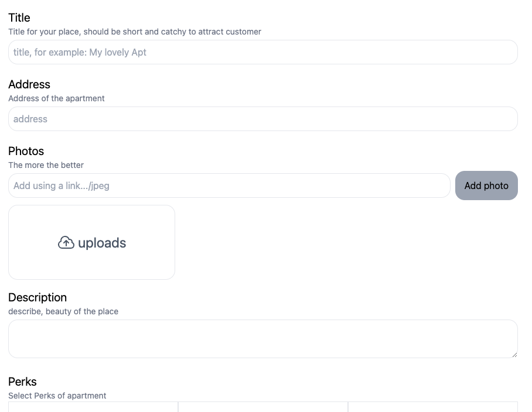

# Aircnc is clone version of online booking site Airbnb
  This program has functionality to see the list of Places uploaded by Owner, by registering you can add your places to listing of owners for night staying

## It's has been deployed 
<a href="https://ashishlal07.github.io/aircnc_client" target="blank">airCncDeployedPage</a>  :- wait for while or Click on Logo as backend works on render take time to load data
 
<a href="https://github.com/AshishLal07/aircnc_backend" target="blank">backendRepo</a> :- For Backend repo 
    
    

## HomePage of the airCnc Booking App

## Booking page of the Place

.png)

## Photo Gallery page of the Place

## All your booking in one page

## All your places in one page

## User Added places can be updated

.png)

## Add new place to be reserved

.png)

## airCnc login page

# airCnc registration page

